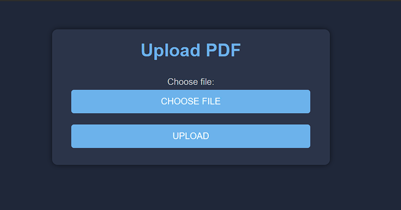

# Single Document RAG Application



## Overview

The Single Document RAG Application is a Python-based tool built using LangChain and Hugging Face technologies. It facilitates the Red, Amber, Green (RAG) process by allowing users to ask questions and extract information from a single PDF document that they upload. This application streamlines the information retrieval process, making it efficient and intuitive for users to analyze and assess the content of their documents.

## Features

- Upload a single PDF document for analysis.
- Ask questions related to the content of the document.
- Utilize the RAG process to categorize information as Red (negative), Amber (neutral), or Green (positive).
- View the extracted information and categorized responses.

## Installation

To run the application locally, follow these steps:

1. Clone the repository:

```bash
git clone https://github.com/Abhivandan7/single_doc_RAG_application.git
cd single_doc_RAG_application
```
2. Create a new virtual environment:
On Windows:

```bash
python -m venv <your-env>
```
On Unix or MacOS:

```bash
python3 -m venv <your-env>
```

3. Activate the virtual environment:
On Windows:

```bash
<your-env>\Scripts\activate
```
On Unix or MacOS:

```bash
source <your-env>/bin/activate
```

4. Install the required dependencies using pip:

```bash
pip install -r requirements.txt
```

5. Obtain a Hugging Face Hub API token and store it in a `.env` file. Here's an example of how to structure your `.env` file:

```plaintext
HUGGINGFACEHUB_API_TOKEN=your-huggingface-token-here
```

6. Run the application:

```bash
python app.py
```

## Usage

1. Open a web browser and navigate to `http://localhost:5000`.
2. Upload a single PDF document using the provided interface.
3. Ask questions related to the content of the document in the input field.
4. Review the extracted information and categorized responses displayed on the screen.

## Screenshots


## Dependencies

- Python 3
- LangChain
- Hugging Face Transformers
- Flask
- Other dependencies listed in `requirements.txt`

## License

This project is licensed under the [MIT License](LICENSE).
